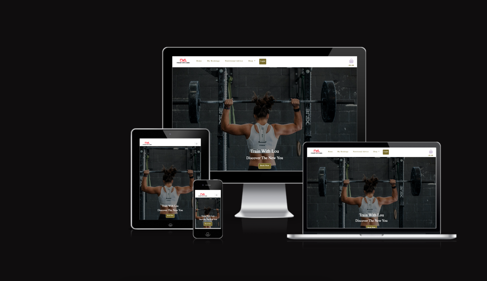
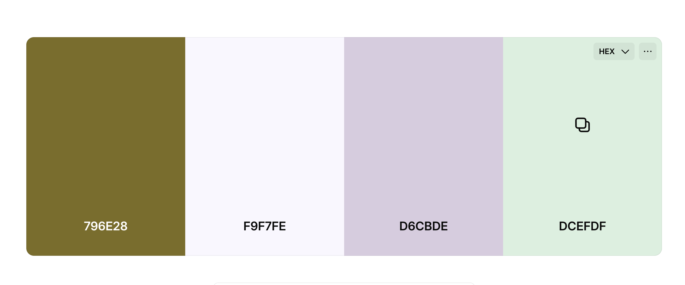

# project4-fitnesswithlou(https://github.com/Louiseskinner01/project4-fitnesswithlou

Developer: Louise Skinner ([Louiseskinner01](https://www.github.com/Louiseskinner01))


[](https://github.com/Louiseskinner01/project4-fitnesswithlou
/commits/main)
[](https://www.github.com/Louiseskinner01/project4-fitnesswithlou/commits/main)
[](https://www.github.com/Louiseskinner01/project4-fitnesswithlou)
[](https://project4-fwl-ce947c9798e9.herokuapp.com/)

## FWL - Fitness With Louise


### Overview

FWL (Fitness With Louise) is a full-stack e-commerce and booking platform built for a personal fitness and training business. The site allows users to browse and purchase fitness apparel, book fitness classes led by qualified instructors, and subscribe to recurring membership plans for ongoing access to exclusive content and benefits.

The platform was designed to bring together everything a fitness business needs into one seamless experience — combining a fully functional online store, a class booking system, and a subscription-based membership model, all backed by secure Stripe payment processing.

### Key Features

- 🛍️ **E-commerce store** — browse and purchase fitness apparel with secure Stripe checkout
- 📅 **Class bookings** — view a live class timetable and book sessions with instructors
- ⭐ **Subscriptions** — choose from Basic, Premium or VIP membership plans with recurring monthly billing
- 👤 **User accounts** — manage your profile, view order history, and track your active subscription
- 📧 **Automated emails** — order and subscription confirmation emails sent automatically
- 📱 **Responsive design** — fully optimised for mobile, tablet and desktop devices

**Site Mockups**


source: [project4-fitnesswithlou amiresponsive](https://ui.dev/amiresponsive?url=https://project4-fwl-ce947c9798e9.herokuapp.com/)

> **Note:** The live mockup link above will show a "refused to connect" error if clicked. This is because Django's `X-Frame-Options` security setting blocks the site from being embedded in an iframe (which the mockup tool requires) — this is intentional and protects the site from clickjacking attacks. The screenshot above was generated by temporarily disabling this setting, then reverting it immediately afterwards for production security.

### The 5 Planes of UX
#### 1. Strategy

**Purpose**
Many small fitness businesses rely on a patchwork of separate tools — one platform for bookings, another for selling merchandise, and a third for managing memberships. FWL solves this by bringing all three together under a single, easy-to-use platform that benefits both the business owner and the end user:

**For customers** 
— a simple way to browse and buy fitness apparel, book classes that suit their schedule, and subscribe to a membership plan that gives them ongoing access and benefits, all from one account.
**For the business** 
— a centralised system to manage products, class schedules, and subscriber data, with automated payment processing, email confirmations, and order tracking handled behind the scenes.
**Site Owner Goals**
- Provide a simple and accessible e-commerce platform.
- Enable online purchases via Stripe Payment.
- Demonstrate full-stack development capability.

#### 2. Scope

**[Features](#features)** (see below)
- User registration and authentication.
- Book and cancel classes.
- File uplaod (Superusers can upload products and general users can upload their cv).
- Add, Edit & Delete 
- Make online purchases
- View personal profile.
- Responsive navigation.
- Emails (confirmation emails for classess booked)
- Toast messages for an interactive UX

**Content Requirements**

The following content needed to be created, sourced, and managed for the platform to function as intended:

- **Product content** — names, descriptions, prices, sizes, categories and high quality images for all fitness apparel items, uploaded and stored via Cloudinary.
- **Class & timetable content** — class types, instructor names, dates, times, durations and capacity limits for the booking system.
- **Subscription plan content** — clear descriptions, pricing and benefits for each membership tier (Basic, Premium, VIP) to help users choose the right plan.
- **User-generated content** — careers enquiries and CVs submitted via the Join Us page, and newsletter sign-ups collected through the footer form.
- **Transactional content** — automated confirmation emails for orders, subscriptions and class bookings, ensuring users receive timely, accurate information about their purchases and bookings.
- **Static page content** — copy for the About Us, Contact Us and Join the Team pages, written to reflect the brand voice and provide genuine value to visitors.
- **Legal & informational content** — clear pricing, delivery information and free delivery thresholds displayed transparently throughout the checkout process.

#### 3. Structure

**Information Architecture**
- **Navigation Menu**:
   - Navigation Menu: A dynamic nav bar that displays different nav links depending on whether the user is logged in or not. If the user is not logged in they will have access to the following links: Home (landing page), Subscriptions, Shop, Nutrition, Login and Signup. However the user is logged in they will have access to "User Authenticated" pages such as: Profile, Boookings, and Classes.

**User Flow**
  - Landing page accessible to all users.
  - The "Profile" page allows users to:
      - View purchase order history.
      - Update their personal information.
      - Subscribe or canel an existing subscription.

  - The "Products" page allows users to:
      - View products in further detail by clicking on the "view products" button.
      - Superusers can access the "Product Admin" page or delete a product by clicking on the "delete" button.
  - The "Product Admin" page allows Superusers to Add, Edit and Delete products.
  - The "Product Details" page allows users to view a product image more clearly, select a size (if plicable) and quantity of a product and add it the cart.
  - The "Shopping Cart" page allows users to increase/decrease the quantity of an item in their cart, head to the "Chedckout" or click the "Continue Shopping" button where they will be redirected to the Products page.
  - The "Success" page is a simple template that provides the user with a thank you message along with a summery of their order.
  - Conditional navigation links based on login state.

#### 4. Skeleton

**[Wireframes](#wireframes)** (see below)

#### 5. Surface

**Visual Design Elements**
- **[Design](#colour-scheme)** (see below)
- **[Colours](#colour-scheme)** (see below)
- **[Typography](#typography)** (see below)


## Design
FWL's visual identity blends raw, gym-floor energy with understated elegance. The striking black and white hero photography sets a bold, editorial tone — strong, unfiltered and confident — while the warm, muted colour palette (Deep Olive, Ghost White, Thistle and Honeydew) softens that intensity with a touch of femininity and approachability.

The result is a design that feels equally at home in a serious training environment and a considered lifestyle brand: tough enough to motivate, polished enough to trust.

## Design

Before physically building the web pages it was important to design (model) the database to understand how data will flow when the user is interacting with the web application. Below is an ERD (entity relationship diagram) screenshot modelling the database.

**ERD**


Several models have been customised with predefined choice fields to enhance the user experience, ensure data consistency, and simplify form inputs. Examples include:

### Database Design

**SubscriptionPlan Model**<br>
```python
PLAN_CHOICES = [
    ('basic', 'Basic Membership'),
    ('premium', 'Premium Membership'),
    ('vip', 'VIP Membership'),
]

name = models.CharField(max_length=50, choices=PLAN_CHOICES)
billing_cycle = models.CharField(
    max_length=20,
    choices=[
        ('monthly', 'Monthly'),
        ('yearly', 'Yearly'),
    ],
    default='monthly'
)
```

**JobApplication Model**<br>
```python
POSITION_CHOICES = [
    ('', 'Select a job role...'),
    ('marketing', 'Marketing'),
    ('fitness_coach', 'Fitness Coach'),
    ('sales', 'Sales'),
]

position = models.CharField(max_length=50, choices=POSITION_CHOICES, blank=True, default='')
```

**UserSubscription Model**<br>
```python
STATUS_CHOICES = [
    ('active', 'Active'),
    ('cancelled', 'Cancelled'),
    ('expired', 'Expired'),
]

status = models.CharField(max_length=20, choices=STATUS_CHOICES, default='active')
```

Using `choices` on these fields restricts user input to valid, predefined options — reducing data entry errors and ensuring consistent values are stored and displayed throughout the platform (e.g. in the admin panel, profile pages, and Stripe price mapping).
### Colour Scheme
Colour pallet:
- **--primary-color: rgb(121, 110, 40);**
- **--feature-color: rgb(249, 247, 254);**
- **--bg1-color: rgb(214, 203, 222);**
- **--btn-color: rgb(220, 239, 223);**



### Typography

FWL uses a single typeface throughout the site — **Lato** — chosen for its clean, modern and highly legible appearance across both headings and body text. Using one consistent font family reinforces a cohesive, professional brand identity rather than introducing unnecessary visual noise.

Font weight and letter spacing are used strategically instead of multiple typefaces to create visual hierarchy — bold weights and wider letter spacing for headings and buttons, regular weight for body copy.

[Lato](https://fonts.google.com/specimen/Lato) is sourced from Google Fonts.

## Wireframes

To follow best practice, wireframes were developed for mobile, tablet, and desktop sizes.
I've used [Lucidchart](https://lucid.co/) to design my site wireframes.

| Page | Mobile | Tablet | Desktop |
| --- | --- | --- | --- |
| Home|  | | |
| 404 Error |  | | |
| Bookings |  |  | |
| Classes |  | | | 
| Products |  | | |
| Product detailS |  | | |
| Shopping cart |  | | |
| Cart |  |
| Success |  | | |
| Sign up |  | | |
| Login |  | | |


## User Stories

### User requirements

| Target | Expectation | Outcome |
| --- | --- | --- |
| As a user | I would like to create an account | so I can use the FWL platform. |
| As a user | I would like to log in and out of my account | so my profile and order history are kept safe from non-authenticated users. |
| As a user | I would like to view a list of fitness apparel products | so that I can browse what's available to purchase. |
| As a user | I would like to view individual product details | so that I can see the price, description and available sizes before buying. |
| As a user | I would like to add products to my shopping cart | so that I can purchase multiple items in one order. |
| As a user | I would like to adjust the quantity of items in my cart | so that I have full control over what I'm purchasing. |
| As a user | I would like to remove items from my cart | so that I can change my mind before checking out. |
| As a user | I would like to securely pay for my order using Stripe | so that I can trust my payment details are safe. |
| As a user | I would like to receive a confirmation email after purchase | so that I have a record of my order. |
| As a user | I would like to view my order history on my profile | so that I can keep track of what I've previously purchased. |
| As a user | I would like to view a class timetable | so that I can see what fitness classes are available. |
| As a user | I would like to book a class | so that I can attend a fitness session led by an instructor. |
| As a user | I would like to cancel a class booking | so that I have flexibility if my plans change. |
| As a user | I would like to receive a confirmation toast when I book a class | so that I know my booking was successful. |
| As a user | I would like to subscribe to a membership plan | so that I can access ongoing benefits as a member. |
| As a user | I would like to cancel my subscription | so that I have control over my recurring payments. |
| As a user | I would like my subscription to remain active until the end of the billing period after cancelling | so that I'm not cut off immediately after paying. |
| As a user | I would like to view my active subscription on my profile | so that I can see my current membership status. |
| As a superuser | I would like to upload, edit and delete products | so that I can manage the store's inventory. |
| As a user | I would like to upload my CV when applying for a job | so that I can be considered for a role at FWL. |
| As a user | I would like to sign up to the newsletter | so that I can stay up to date with the latest news. |
| As a user | I want access to a simple and clean navbar | so I can easily navigate through the website's pages. |

### Accessibility & Usability

| Target | Expectation | Outcome |
| --- | --- | --- |
| As a visually impaired user | I want clear colour contrasts | so that I can see buttons, prices and important information more clearly. |
| As a user with little computer skills | I want a simple, intuitive website | so I can fully utilise the site's features without confusion. |
| As a mobile user | I want large, tap-friendly buttons | so that I can browse and purchase easily on my phone. |
| As a user | I want toast notifications for key actions (booking, purchasing, cancelling) | so that I have clear, immediate feedback on what's happened. |

### Content & Motivation

| Target | Expectation | Outcome |
| --- | --- | --- |
| As a new customer | I want to browse fitness apparel without pressure | so that I can decide in my own time what to purchase. |
| As a fitness enthusiast | I want to book classes that suit my schedule | so that I can stay consistent with my training. |
| As a returning customer | I want a subscription plan that gives me ongoing value | so that I feel committed to my fitness journey with FWL. |

## Features

### Existing Features

| Feature | Notes | Screenshot |
| --- | --- | --- |
| User Registration | Users can create an account with username, email and password, with mandatory email verification. |  |
| Login / Logout | Secure authentication via django-allauth with conditional navigation links based on login state. | <br> |
| User Profile | Dedicated profile page displaying order history and active subscription. Access restricted to authenticated users. |  |
| Product Catalogue | Browse all products by category with images, prices and quick add-to-cart functionality. |  |
| Product Details | Individual product page showing description, price, available sizes and quantity selector. |  |
| Add/Edit/Delete Products | Superusers can manage the product catalogue directly from the front end. |  |
| Shopping Cart | View, update quantities, and remove items from the cart with live total recalculation. |  |
| Stripe Checkout | Secure payment processing for one-off purchases via Stripe. |  |
| Order Confirmation Email | Automated email sent on successful purchase confirming order details. |  |
| Class Timetable | Displays all available fitness classes with instructor, date, time and capacity. |  |
| Book / Cancel Class | Users can book and cancel classes, with capacity limits enforced. |  |
| Subscription Plans | Users can choose from Basic, Premium and VIP membership plans with recurring billing via Stripe. |  |
| Cancel Subscription | Subscriptions cancel at the end of the current billing period rather than immediately. |  |
| Subscription Confirmation Email | Automated email sent confirming a new subscription. |  |
| Job Application / CV Upload | Users can apply to join the team via the Join Us page, with CV file upload. |  |
| Newsletter Sign Up | Simple email capture form for newsletter sign ups, stored in the database. |  |
| Toast Notifications | Custom styled toast messages for success, error, warning and info feedback throughout the site. |  |
| Responsive Navbar | Navigation adapts based on authentication state and screen size, including a dropdown account menu. | <br> |
| Responsive Design | Bootstrap grid and fluid images ensure mobile-first compatibility across the entire site. | <br> |


### Future Features

- **Dark mode toggle** — allow users to switch between light and dark themes for a more personalised browsing experience.
- **Personal calendar/diary** — a dedicated space for each user to log workouts, track progress and view upcoming booked classes in one place.
- **Recurring Stripe subscription dashboard** — allow users to view full billing history, upcoming payment dates, and download invoices directly from their profile.
- **Product reviews & ratings** — allow customers to leave star ratings and written reviews on products they've purchased.
- **Wishlist functionality** — let users save products they're interested in for later, without adding them to the cart.
- **Class waitlist** — when a class reaches capacity, allow users to join a waitlist and be automatically notified if a space becomes available.
- **Instructor profiles** — dedicated pages for each instructor with their bio, specialities and class schedule.
- **Loyalty/rewards points** — reward customers with points for purchases and class attendance, redeemable against future orders or subscriptions.
- **Live chat support** — integrate a simple live chat widget for real-time customer queries.
- **Progress tracking dashboard** — allow users to log measurements, weights or personal bests and visualise their progress over time with charts.
- **Push notifications** — remind users of upcoming class bookings or subscription renewal dates.
- **Multi-language support** — translate the site for a broader, more inclusive audience.
- **Gift cards / vouchers** — allow customers to purchase and redeem gift cards for products or memberships.


CSS — works locally with DEBUG = True because WhiteNoise serves static files differently in debug mode
Images — don't show locally because they're now stored in Cloudinary, and your local MEDIA_ROOT folder doesn't have them anymore
Mobile layout — looks different because you're testing on a different screen/browser locally